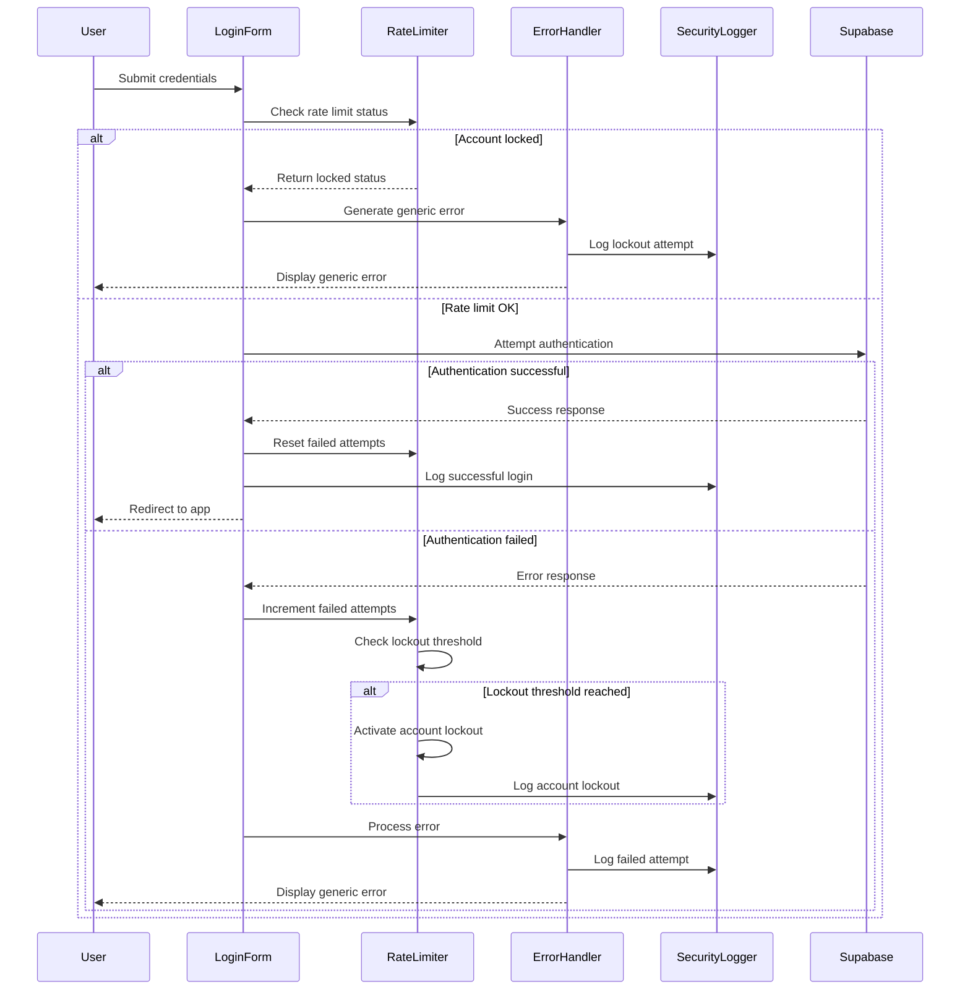

# Authentication Security Enhancement Design Document

## Overview

This document outlines the design for enhancing authentication security in the Todo2 application. The enhancement implements rate limiting, account lockout mechanisms, secure error handling, and comprehensive security logging to protect against brute force attacks and improve overall authentication security posture.

## Architecture

### Security Enhancement Components

```
┌─────────────────────────────────────────────────────────────┐
│                Authentication Security Layer                │
├─────────────────────────────────────────────────────────────┤
│ 1. Rate Limiting Manager                                    │
│    ├── Failed Attempt Counter                              │
│    ├── Account Lockout Controller                          │
│    └── Lockout State Persistence                           │
├─────────────────────────────────────────────────────────────┤
│ 2. Secure Error Handler                                    │
│    ├── Error Message Sanitizer                            │
│    ├── Generic Message Generator                          │
│    └── Security Event Logger                              │
├─────────────────────────────────────────────────────────────┤
│ 3. Security State Manager                                  │
│    ├── Client-Side State Storage                          │
│    ├── State Validation                                   │
│    └── Automatic State Cleanup                            │
├─────────────────────────────────────────────────────────────┤
│ 4. Enhanced LoginForm                                      │
│    ├── Progressive Delay Implementation                    │
│    ├── Concurrent Request Prevention                      │
│    └── Secure Form Data Handling                          │
└─────────────────────────────────────────────────────────────┘
```

### Security Flow Design



## Components and Interfaces

### 1. Rate Limiting Manager

**Purpose**: Manage failed authentication attempts and account lockout logic

```typescript
interface RateLimitManager {
  checkRateLimit(identifier: string): Promise<RateLimitStatus>;
  incrementFailedAttempts(identifier: string): Promise<void>;
  resetFailedAttempts(identifier: string): Promise<void>;
  isAccountLocked(identifier: string): Promise<boolean>;
  getRemainingLockoutTime(identifier: string): Promise<number>;
}

interface RateLimitStatus {
  isLocked: boolean;
  remainingTime?: number;
  attemptsRemaining?: number;
  canAttempt: boolean;
}

interface RateLimitConfig {
  maxAttempts: number;
  lockoutDuration: number; // in milliseconds
  progressiveDelay: boolean;
  storageKey: string;
}
```

**Implementation Details**:
- Uses localStorage for client-side state persistence
- Implements exponential backoff for progressive delays
- Stores encrypted lockout state to prevent tampering
- Automatic cleanup of expired lockout states

### 2. Secure Error Handler

**Purpose**: Sanitize and standardize error messages while maintaining security logging

```typescript
interface SecurityErrorHandler {
  handleAuthError(error: AuthError, context: ErrorContext): SecureErrorResponse;
  sanitizeError(error: unknown): string;
  logSecurityEvent(event: SecurityEvent): void;
}

interface SecureErrorResponse {
  userMessage: string;
  shouldLog: boolean;
  logLevel: LogLevel;
  eventType: SecurityEventType;
}

interface ErrorContext {
  userIdentifier?: string;
  attemptCount?: number;
  timestamp: Date;
  userAgent?: string;
  ipAddress?: string;
}

enum SecurityEventType {
  FAILED_LOGIN = 'failed_login',
  ACCOUNT_LOCKED = 'account_locked',
  RATE_LIMIT_EXCEEDED = 'rate_limit_exceeded',
  SUCCESSFUL_LOGIN = 'successful_login',
  LOCKOUT_EXPIRED = 'lockout_expired'
}
```

**Error Message Strategy**:
- Generic messages that don't reveal account existence
- Consistent messaging for all authentication failures
- No exposure of technical error details to users
- Comprehensive server-side logging for security monitoring

### 3. Security State Manager

**Purpose**: Manage client-side security state with secure storage and validation

```typescript
interface SecurityStateManager {
  getSecurityState(identifier: string): Promise<SecurityState>;
  setSecurityState(identifier: string, state: SecurityState): Promise<void>;
  clearSecurityState(identifier: string): Promise<void>;
  validateStateIntegrity(state: SecurityState): boolean;
  cleanupExpiredStates(): Promise<void>;
}

interface SecurityState {
  failedAttempts: number;
  lockoutUntil?: Date;
  lastAttempt?: Date;
  progressiveDelay?: number;
  checksum: string; // For integrity validation
}

interface SecureStorage {
  encrypt(data: string): string;
  decrypt(data: string): string;
  store(key: string, value: string): void;
  retrieve(key: string): string | null;
  remove(key: string): void;
}
```

**Security Features**:
- Encrypted storage to prevent client-side tampering
- Integrity validation using checksums
- Automatic cleanup of expired states
- Secure key derivation for storage encryption

### 4. Enhanced LoginForm Component

**Purpose**: Integrate security enhancements into the authentication UI

```typescript
interface EnhancedLoginFormProps {
  onSuccess?: (user: User) => void;
  onError?: (error: string) => void;
  rateLimitConfig?: RateLimitConfig;
}

interface LoginFormState {
  email: string;
  password: string;
  loading: boolean;
  error: string | null;
  isLocked: boolean;
  remainingLockoutTime: number;
  progressiveDelay: number;
}

interface AuthenticationAttempt {
  email: string;
  password: string;
  timestamp: Date;
  userAgent: string;
  sessionId: string;
}
```

**Security Features**:
- Progressive delay implementation for failed attempts
- Concurrent request prevention
- Secure form data clearing after submission
- Real-time lockout status updates
- Client-side validation before submission

## Data Models

### Security Event Model

```typescript
interface SecurityEvent {
  id: string;
  type: SecurityEventType;
  timestamp: Date;
  userIdentifier: string;
  details: SecurityEventDetails;
  severity: SecuritySeverity;
  source: EventSource;
}

interface SecurityEventDetails {
  attemptCount?: number;
  lockoutDuration?: number;
  userAgent?: string;
  ipAddress?: string;
  errorCode?: string;
  additionalContext?: Record<string, any>;
}

enum SecuritySeverity {
  LOW = 'low',
  MEDIUM = 'medium',
  HIGH = 'high',
  CRITICAL = 'critical'
}

enum EventSource {
  CLIENT = 'client',
  SERVER = 'server',
  SYSTEM = 'system'
}
```

### Rate Limit Storage Model

```typescript
interface RateLimitRecord {
  identifier: string;
  failedAttempts: number;
  lockoutUntil?: Date;
  lastAttempt: Date;
  progressiveDelay: number;
  createdAt: Date;
  updatedAt: Date;
}

interface EncryptedStorageRecord {
  data: string; // Encrypted SecurityState
  checksum: string;
  timestamp: Date;
  version: number;
}
```

## Error Handling

### Security Error Categories

```typescript
enum AuthSecurityErrorType {
  RATE_LIMIT_EXCEEDED = 'RATE_LIMIT_EXCEEDED',
  ACCOUNT_LOCKED = 'ACCOUNT_LOCKED',
  INVALID_CREDENTIALS = 'INVALID_CREDENTIALS',
  NETWORK_ERROR = 'NETWORK_ERROR',
  VALIDATION_ERROR = 'VALIDATION_ERROR',
  STORAGE_ERROR = 'STORAGE_ERROR',
  ENCRYPTION_ERROR = 'ENCRYPTION_ERROR'
}

interface AuthSecurityError extends Error {
  type: AuthSecurityErrorType;
  code: string;
  userMessage: string;
  logMessage: string;
  context: ErrorContext;
  shouldRetry: boolean;
}
```

### Error Recovery Strategies

1. **Rate Limit Exceeded**: Display lockout message with generic timing
2. **Storage Errors**: Fallback to memory-based rate limiting
3. **Encryption Errors**: Clear corrupted state and restart tracking
4. **Network Errors**: Implement retry logic with exponential backoff
5. **Validation Errors**: Reset form state and display generic error

### Error Message Mapping

```typescript
const ERROR_MESSAGES: Record<AuthSecurityErrorType, string> = {
  RATE_LIMIT_EXCEEDED: "Too many login attempts. Please try again later.",
  ACCOUNT_LOCKED: "Too many login attempts. Please try again later.",
  INVALID_CREDENTIALS: "Invalid credentials. Please check your email and password.",
  NETWORK_ERROR: "Connection error. Please check your internet connection and try again.",
  VALIDATION_ERROR: "Please check your input and try again.",
  STORAGE_ERROR: "A temporary error occurred. Please try again.",
  ENCRYPTION_ERROR: "A security error occurred. Please refresh the page and try again."
};
```

## Testing Strategy

### Security Testing Approach

#### 1. Rate Limiting Tests

```typescript
describe('Rate Limiting Security', () => {
  test('should lock account after max failed attempts', async () => {
    // Test lockout activation
  });
  
  test('should maintain lockout across browser sessions', async () => {
    // Test state persistence
  });
  
  test('should automatically unlock after lockout period', async () => {
    // Test automatic unlock
  });
  
  test('should reset attempts counter on successful login', async () => {
    // Test counter reset
  });
});
```

#### 2. Error Handling Tests

```typescript
describe('Secure Error Handling', () => {
  test('should display generic messages for all auth failures', async () => {
    // Test message consistency
  });
  
  test('should sanitize error messages to prevent XSS', async () => {
    // Test XSS prevention
  });
  
  test('should log detailed security events', async () => {
    // Test security logging
  });
});
```

#### 3. Security State Tests

```typescript
describe('Security State Management', () => {
  test('should encrypt security state in storage', async () => {
    // Test encryption
  });
  
  test('should validate state integrity', async () => {
    // Test integrity validation
  });
  
  test('should cleanup expired states', async () => {
    // Test cleanup functionality
  });
});
```

#### 4. Integration Tests

```typescript
describe('Authentication Security Integration', () => {
  test('should handle complete brute force attack scenario', async () => {
    // Test end-to-end security flow
  });
  
  test('should maintain security across component remounts', async () => {
    // Test React component lifecycle
  });
  
  test('should handle concurrent authentication attempts', async () => {
    // Test concurrency protection
  });
});
```

### Performance Considerations

1. **Client-Side Storage**: Minimize storage operations and implement efficient cleanup
2. **Progressive Delays**: Use setTimeout for non-blocking delay implementation
3. **State Validation**: Optimize checksum calculation for large state objects
4. **Memory Management**: Implement proper cleanup of timers and event listeners
5. **Encryption Performance**: Use efficient encryption algorithms for client-side operations

### Security Validation

1. **Penetration Testing**: Simulate brute force attacks to validate rate limiting
2. **State Tampering Tests**: Attempt to modify client-side security state
3. **Timing Attack Prevention**: Ensure consistent response times for all error scenarios
4. **Information Disclosure Tests**: Verify no sensitive information leaks through error messages
5. **Bypass Attempt Tests**: Test various methods to circumvent rate limiting

This design provides a comprehensive security enhancement that protects against brute force attacks while maintaining a good user experience and providing detailed security monitoring capabilities.