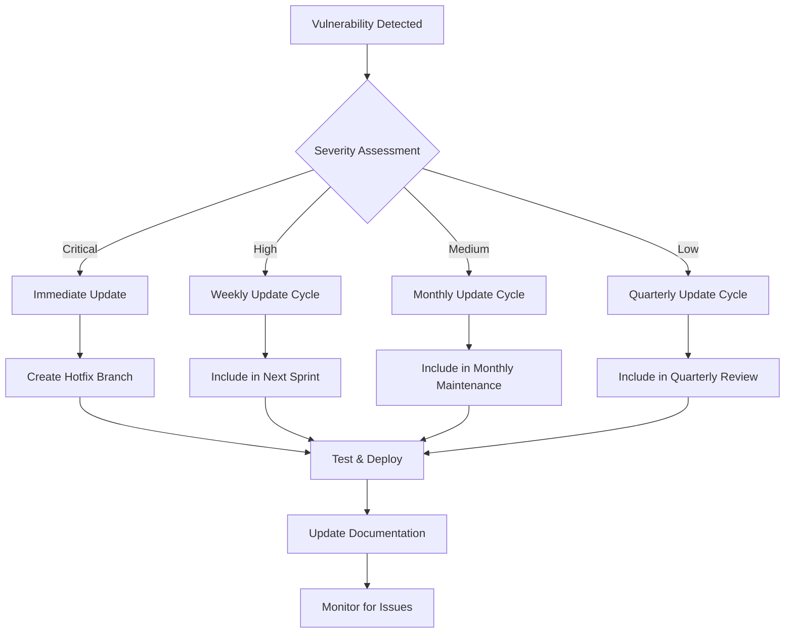

# Dependency Security Management Plan

## Executive Summary

This document outlines a comprehensive dependency security management strategy for the Todo2 application. The plan establishes processes for monitoring, updating, and securing both Node.js and Rust dependencies to maintain a robust security posture.

## Current Dependency Landscape

### Node.js Dependencies
- **Total Dependencies**: 648 (63 production, 584 development)
- **Package Manager**: npm
- **Key Dependencies**: React, Vite, Supabase client, Tauri API
- **Security Tools**: ESLint security plugin, npm audit

### Rust Dependencies  
- **Total Dependencies**: 507
- **Package Manager**: Cargo
- **Key Dependencies**: Tauri, serde, directories
- **Security Tools**: cargo-audit

## Security Management Framework

### 1. Automated Dependency Scanning

#### Daily Automated Scans

**Implementation**: GitHub Actions workflow for continuous monitoring

```yaml
# .github/workflows/dependency-security.yml
name: Dependency Security Scan

on:
  schedule:
    - cron: '0 2 * * *'  # Daily at 2 AM UTC
  push:
    branches: [main, develop]
  pull_request:
    branches: [main]

jobs:
  npm-security-scan:
    runs-on: ubuntu-latest
    steps:
      - uses: actions/checkout@v4
      
      - name: Setup Node.js
        uses: actions/setup-node@v4
        with:
          node-version: '18'
          cache: 'npm'
      
      - name: Install dependencies
        run: npm ci
      
      - name: Run npm audit
        run: |
          npm audit --audit-level moderate --json > npm-audit-results.json
          npm audit --audit-level moderate
        continue-on-error: true
      
      - name: Upload npm audit results
        uses: actions/upload-artifact@v4
        with:
          name: npm-audit-results
          path: npm-audit-results.json

  cargo-security-scan:
    runs-on: ubuntu-latest
    steps:
      - uses: actions/checkout@v4
      
      - name: Setup Rust
        uses: actions-rs/toolchain@v1
        with:
          toolchain: stable
          override: true
      
      - name: Install cargo-audit
        run: cargo install cargo-audit
      
      - name: Run cargo audit
        working-directory: src-tauri
        run: |
          cargo audit --json > ../cargo-audit-results.json
          cargo audit
        continue-on-error: true
      
      - name: Upload cargo audit results
        uses: actions/upload-artifact@v4
        with:
          name: cargo-audit-results
          path: cargo-audit-results.json

  security-report:
    needs: [npm-security-scan, cargo-security-scan]
    runs-on: ubuntu-latest
    steps:
      - uses: actions/checkout@v4
      
      - name: Download audit results
        uses: actions/download-artifact@v4
        with:
          pattern: '*-audit-results'
          merge-multiple: true
      
      - name: Generate security report
        run: |
          node scripts/generate-security-report.js
      
      - name: Create issue on vulnerabilities
        if: failure()
        uses: actions/github-script@v7
        with:
          script: |
            github.rest.issues.create({
              owner: context.repo.owner,
              repo: context.repo.repo,
              title: 'Security vulnerabilities detected in dependencies',
              body: 'Automated security scan detected vulnerabilities. Please review the workflow logs.',
              labels: ['security', 'dependencies']
            })
```

#### Package.json Scripts Enhancement

```json
{
  "scripts": {
    "security:audit": "npm audit --audit-level moderate",
    "security:audit:fix": "npm audit fix",
    "security:audit:json": "npm audit --audit-level moderate --json",
    "security:rust-audit": "cd src-tauri && cargo audit",
    "security:rust-audit:json": "cd src-tauri && cargo audit --json",
    "security:full-scan": "npm run security:audit && npm run security:rust-audit",
    "security:report": "node scripts/generate-security-report.js",
    "security:update-check": "npm outdated && cd src-tauri && cargo outdated"
  }
}
```

### 2. Dependency Update Management

#### Update Classification System

**Critical Updates (Immediate - within 24 hours)**:
- Security vulnerabilities with CVSS score ≥ 7.0
- Authentication/authorization related vulnerabilities
- Remote code execution vulnerabilities
- Data exposure vulnerabilities

**High Priority Updates (within 1 week)**:
- Security vulnerabilities with CVSS score 4.0-6.9
- Dependencies with known exploits
- Unmaintained packages with security implications

**Medium Priority Updates (within 1 month)**:
- Minor security improvements
- Performance-related updates
- Dependency maintenance updates

**Low Priority Updates (quarterly)**:
- Feature updates
- Non-security bug fixes
- Development dependency updates

#### Update Process Workflow



#### Automated Update Scripts

**Node.js Dependency Updates**:
```bash
#!/bin/bash
# scripts/update-npm-dependencies.sh

set -e

echo "🔍 Checking for npm dependency updates..."

# Check for outdated packages
npm outdated --json > outdated-packages.json

# Update patch versions automatically
npm update

# Check for security vulnerabilities
npm audit --audit-level moderate

# Generate update report
node scripts/generate-update-report.js

echo "✅ npm dependency update check complete"
```

**Rust Dependency Updates**:
```bash
#!/bin/bash
# scripts/update-cargo-dependencies.sh

set -e

echo "🔍 Checking for Rust dependency updates..."

cd src-tauri

# Install cargo-outdated if not present
if ! command -v cargo-outdated &> /dev/null; then
    cargo install cargo-outdated
fi

# Check for outdated crates
cargo outdated --json > ../outdated-crates.json

# Update Cargo.lock
cargo update

# Run security audit
cargo audit

echo "✅ Cargo dependency update check complete"
```

### 3. Security Monitoring and Alerting

#### Monitoring Tools Integration

**GitHub Dependabot Configuration**:
```yaml
# .github/dependabot.yml
version: 2
updates:
  # Node.js dependencies
  - package-ecosystem: "npm"
    directory: "/"
    schedule:
      interval: "weekly"
      day: "monday"
      time: "09:00"
    open-pull-requests-limit: 10
    reviewers:
      - "security-team"
    assignees:
      - "lead-developer"
    commit-message:
      prefix: "security"
      include: "scope"
    labels:
      - "dependencies"
      - "security"

  # Rust dependencies
  - package-ecosystem: "cargo"
    directory: "/src-tauri"
    schedule:
      interval: "weekly"
      day: "monday"
      time: "09:00"
    open-pull-requests-limit: 5
    reviewers:
      - "security-team"
    assignees:
      - "lead-developer"
    commit-message:
      prefix: "security"
      include: "scope"
    labels:
      - "dependencies"
      - "security"
      - "rust"
```

**Snyk Integration** (Optional):
```yaml
# .snyk
version: v1.0.0
language-settings:
  javascript:
    ignoreDevDependencies: false
  rust:
    ignoreDevDependencies: false
patch: {}
ignore: {}
```

#### Alert Configuration

**Slack/Discord Webhook Integration**:
```javascript
// scripts/security-alerts.js
const webhook = process.env.SECURITY_WEBHOOK_URL;

async function sendSecurityAlert(vulnerabilities) {
  const message = {
    text: "🚨 Security vulnerabilities detected in dependencies",
    attachments: [
      {
        color: "danger",
        fields: [
          {
            title: "Critical Vulnerabilities",
            value: vulnerabilities.critical.length,
            short: true
          },
          {
            title: "High Vulnerabilities", 
            value: vulnerabilities.high.length,
            short: true
          }
        ]
      }
    ]
  };

  await fetch(webhook, {
    method: 'POST',
    headers: { 'Content-Type': 'application/json' },
    body: JSON.stringify(message)
  });
}
```

### 4. Testing and Validation Framework

#### Pre-Update Testing Protocol

**Automated Test Suite**:
```bash
#!/bin/bash
# scripts/pre-update-tests.sh

echo "🧪 Running pre-update test suite..."

# Run unit tests
npm test

# Run integration tests
npm run test:integration

# Run security tests
npm run test:security

# Build application
npm run build

# Run Tauri tests
cd src-tauri
cargo test

echo "✅ Pre-update tests completed"
```

**Security-Specific Tests**:
```javascript
// tests/security/dependency-security.test.js
describe('Dependency Security', () => {
  test('should not have critical vulnerabilities', async () => {
    const auditResult = await runNpmAudit();
    expect(auditResult.vulnerabilities.critical).toBe(0);
  });

  test('should not have high severity vulnerabilities', async () => {
    const auditResult = await runNpmAudit();
    expect(auditResult.vulnerabilities.high).toBeLessThanOrEqual(0);
  });

  test('should have up-to-date security-critical packages', async () => {
    const criticalPackages = ['@supabase/supabase-js', 'react', 'vite'];
    const outdated = await checkOutdatedPackages();
    
    criticalPackages.forEach(pkg => {
      expect(outdated[pkg]).toBeUndefined();
    });
  });
});
```

#### Post-Update Validation

**Regression Testing**:
```bash
#!/bin/bash
# scripts/post-update-validation.sh

echo "🔍 Running post-update validation..."

# Verify application builds
npm run build

# Run full test suite
npm run test:full

# Check for new vulnerabilities
npm audit --audit-level moderate

# Verify Tauri functionality
cd src-tauri
cargo test
cargo audit

# Performance regression tests
npm run test:performance

echo "✅ Post-update validation completed"
```

### 5. Documentation and Knowledge Management

#### Security Documentation Requirements

**Dependency Security Runbook**:
```markdown
# Dependency Security Incident Response

## Immediate Response (Critical Vulnerabilities)
1. Assess vulnerability impact
2. Create hotfix branch
3. Apply security updates
4. Run security test suite
5. Deploy emergency patch
6. Monitor for issues

## Communication Protocol
- Notify security team immediately
- Update stakeholders within 2 hours
- Document incident in security log
- Post-incident review within 24 hours
```

**Update Log Template**:
```markdown
# Dependency Update Log - [Date]

## Updated Packages
### Node.js Dependencies
- package-name: old-version → new-version (Security fix for CVE-XXXX)

### Rust Dependencies  
- crate-name: old-version → new-version (Bug fix)

## Security Impact
- [List security improvements]

## Breaking Changes
- [List any breaking changes]

## Testing Results
- [Summary of test results]

## Rollback Plan
- [Steps to rollback if issues occur]
```

### 6. Compliance and Audit Trail

#### Audit Trail Requirements

**Change Documentation**:
- All dependency updates must be documented
- Security rationale for each update
- Testing results and validation
- Approval workflow completion

**Compliance Reporting**:
```javascript
// scripts/compliance-report.js
function generateComplianceReport() {
  return {
    reportDate: new Date().toISOString(),
    dependencyCount: {
      npm: getNpmDependencyCount(),
      cargo: getCargoDependencyCount()
    },
    vulnerabilities: {
      critical: getCriticalVulnerabilities(),
      high: getHighVulnerabilities(),
      medium: getMediumVulnerabilities(),
      low: getLowVulnerabilities()
    },
    lastUpdateDate: getLastUpdateDate(),
    complianceStatus: assessComplianceStatus()
  };
}
```

### 7. Emergency Response Procedures

#### Critical Vulnerability Response

**Immediate Actions (0-2 hours)**:
1. Assess vulnerability severity and impact
2. Determine if application is affected
3. Create emergency response team
4. Begin hotfix development

**Short-term Actions (2-24 hours)**:
1. Develop and test security patch
2. Prepare deployment plan
3. Communicate with stakeholders
4. Deploy emergency fix

**Follow-up Actions (24-72 hours)**:
1. Monitor application stability
2. Conduct post-incident review
3. Update security procedures
4. Document lessons learned

#### Communication Templates

**Critical Vulnerability Alert**:
```
Subject: CRITICAL: Security vulnerability detected in [Application Name]

A critical security vulnerability has been detected in our dependencies:
- Vulnerability: [CVE/Advisory ID]
- Affected Package: [Package Name]
- Severity: [CVSS Score]
- Impact: [Description]

Immediate actions being taken:
1. [Action 1]
2. [Action 2]

Expected resolution: [Timeline]
Next update: [Time]
```

### 8. Metrics and KPIs

#### Security Metrics Dashboard

**Key Performance Indicators**:
- Mean Time to Detection (MTTD) for vulnerabilities
- Mean Time to Resolution (MTTR) for security updates
- Percentage of dependencies with known vulnerabilities
- Dependency freshness score
- Security test coverage

**Monitoring Queries**:
```javascript
// Dependency age monitoring
const getDependencyAge = async () => {
  const packageJson = require('../package.json');
  const dependencies = { ...packageJson.dependencies, ...packageJson.devDependencies };
  
  const ages = await Promise.all(
    Object.keys(dependencies).map(async (pkg) => {
      const info = await npm.view(pkg, 'time');
      const currentVersion = dependencies[pkg];
      return {
        package: pkg,
        currentVersion,
        publishDate: info[currentVersion],
        age: Date.now() - new Date(info[currentVersion]).getTime()
      };
    })
  );
  
  return ages;
};
```

### 9. Tool Integration and Automation

#### Security Tool Stack

**Primary Tools**:
- npm audit (Node.js vulnerability scanning)
- cargo audit (Rust vulnerability scanning)
- GitHub Dependabot (Automated updates)
- ESLint security plugin (Static analysis)

**Optional Enhanced Tools**:
- Snyk (Advanced vulnerability scanning)
- OWASP Dependency Check (Multi-language scanning)
- Renovate (Alternative to Dependabot)
- Socket Security (Supply chain security)

#### Integration Scripts

**Security Report Generator**:
```javascript
// scripts/generate-security-report.js
const fs = require('fs');
const { execSync } = require('child_process');

async function generateSecurityReport() {
  const npmAudit = JSON.parse(execSync('npm audit --json', { encoding: 'utf8' }));
  const cargoAudit = JSON.parse(execSync('cd src-tauri && cargo audit --json', { encoding: 'utf8' }));
  
  const report = {
    timestamp: new Date().toISOString(),
    npm: {
      vulnerabilities: npmAudit.vulnerabilities,
      summary: npmAudit.metadata
    },
    cargo: {
      vulnerabilities: cargoAudit.vulnerabilities,
      warnings: cargoAudit.warnings
    },
    recommendations: generateRecommendations(npmAudit, cargoAudit)
  };
  
  fs.writeFileSync('security-reports/latest-scan.json', JSON.stringify(report, null, 2));
  return report;
}
```

## Implementation Timeline

### Phase 1 (Week 1-2): Foundation
- [ ] Set up automated scanning workflows
- [ ] Configure Dependabot
- [ ] Create update scripts
- [ ] Establish documentation templates

### Phase 2 (Week 3-4): Monitoring
- [ ] Implement alerting system
- [ ] Set up metrics dashboard
- [ ] Create compliance reporting
- [ ] Test emergency procedures

### Phase 3 (Week 5-6): Optimization
- [ ] Fine-tune alert thresholds
- [ ] Optimize update workflows
- [ ] Enhance testing procedures
- [ ] Train team on procedures

### Phase 4 (Ongoing): Maintenance
- [ ] Regular procedure reviews
- [ ] Metrics analysis and improvement
- [ ] Tool evaluation and updates
- [ ] Continuous process refinement

## Success Criteria

### Quantitative Metrics
- Zero critical vulnerabilities in production
- MTTR for security updates < 24 hours for critical, < 1 week for high
- 95% of dependencies updated within SLA timeframes
- 100% of security updates tested before deployment

### Qualitative Indicators
- Clear audit trail for all dependency changes
- Effective incident response procedures
- Team confidence in security processes
- Stakeholder satisfaction with security posture

## Conclusion

This dependency security management plan provides a comprehensive framework for maintaining secure dependencies in the Todo2 application. The plan emphasizes automation, continuous monitoring, and rapid response to security threats while maintaining development velocity and application stability.

Regular review and updates of this plan ensure it remains effective against evolving security threats and changing dependency landscapes.

---

**Document Version**: 1.0
**Last Updated**: $(date)
**Next Review**: Quarterly
**Owner**: Security Team