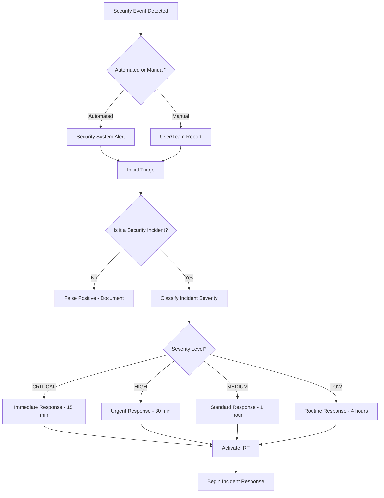

# Security Incident Response Procedures

**Document Version**: 1.0  
**Last Updated**: ${new Date().toISOString()}  
**Owner**: Security Team  
**Scope**: Todo2 Application Security Incident Response

## Table of Contents

1. [Executive Summary](#executive-summary)
2. [Incident Classification](#incident-classification)
3. [Response Team Structure](#response-team-structure)
4. [Detection and Response Workflows](#detection-and-response-workflows)
5. [Communication and Escalation Plans](#communication-and-escalation-plans)
6. [Incident Response Procedures](#incident-response-procedures)
7. [Recovery and Post-Incident Activities](#recovery-and-post-incident-activities)
8. [Testing and Validation](#testing-and-validation)
9. [Appendices](#appendices)

## Executive Summary

This document establishes comprehensive security incident response procedures for the Todo2 application. It defines incident classification, response workflows, communication protocols, and recovery procedures to ensure effective detection, containment, and resolution of security incidents.

### Scope and Applicability

These procedures apply to all security incidents affecting:
- Todo2 web application (React/TypeScript frontend)
- Todo2 desktop application (Tauri/Rust)
- Supabase backend infrastructure
- User data and authentication systems
- Third-party integrations and dependencies

### Incident Response Objectives

1. **Rapid Detection**: Identify security incidents quickly and accurately
2. **Effective Containment**: Limit the scope and impact of security incidents
3. **Swift Recovery**: Restore normal operations with minimal downtime
4. **Evidence Preservation**: Maintain forensic evidence for investigation
5. **Continuous Improvement**: Learn from incidents to strengthen security posture

## Incident Classification

### Security Incident Categories

#### Category 1: Authentication and Authorization Incidents

**Definition**: Incidents involving unauthorized access, authentication bypass, or privilege escalation

**Examples**:
- Brute force attacks on user accounts
- Session hijacking or fixation
- Authentication bypass vulnerabilities
- Privilege escalation attempts
- Unauthorized admin access

**Severity Levels**:
- **CRITICAL**: Admin account compromise, mass user account takeover
- **HIGH**: Individual user account compromise, authentication system failure
- **MEDIUM**: Failed authentication attacks, session anomalies
- **LOW**: Suspicious login patterns, minor authentication errors

#### Category 2: Data Security Incidents

**Definition**: Incidents involving unauthorized access, modification, or disclosure of user data

**Examples**:
- Data breach or unauthorized data access
- Data corruption or integrity violations
- Privacy violations (GDPR, CCPA)
- Database security incidents
- Local storage data exposure

**Severity Levels**:
- **CRITICAL**: Mass data breach, sensitive data exposure
- **HIGH**: Individual user data compromise, database breach
- **MEDIUM**: Data integrity violations, minor data exposure
- **LOW**: Data access anomalies, potential privacy issues

#### Category 3: Application Security Incidents

**Definition**: Incidents involving application vulnerabilities, malicious code, or system compromise

**Examples**:
- Cross-site scripting (XSS) attacks
- SQL injection attempts
- Malicious file uploads
- Code injection vulnerabilities
- Application denial of service

**Severity Levels**:
- **CRITICAL**: Remote code execution, system compromise
- **HIGH**: Data manipulation, application takeover
- **MEDIUM**: XSS attacks, input validation bypass
- **LOW**: Minor vulnerabilities, failed attack attempts

#### Category 4: Infrastructure and Platform Incidents

**Definition**: Incidents affecting the underlying infrastructure, hosting, or platform services

**Examples**:
- Supabase service disruptions
- CDN or hosting provider incidents
- DNS hijacking or manipulation
- SSL/TLS certificate issues
- Third-party service compromises

**Severity Levels**:
- **CRITICAL**: Complete service outage, infrastructure compromise
- **HIGH**: Partial service disruption, security service failure
- **MEDIUM**: Performance degradation, minor service issues
- **LOW**: Monitoring alerts, configuration warnings

#### Category 5: Desktop Application Incidents

**Definition**: Incidents specific to the Tauri desktop application

**Examples**:
- Privilege escalation in desktop app
- File system access violations
- Update mechanism compromise
- Native API abuse
- Desktop-specific malware

**Severity Levels**:
- **CRITICAL**: System-level compromise, malware distribution
- **HIGH**: Privilege escalation, file system breach
- **MEDIUM**: Permission violations, update issues
- **LOW**: Desktop configuration issues, minor violations

### Incident Severity Matrix

| Impact | Confidentiality | Integrity | Availability | Severity |
|--------|----------------|-----------|--------------|----------|
| High | Mass data breach | Data corruption | Complete outage | CRITICAL |
| Medium | Individual data exposure | Limited corruption | Partial outage | HIGH |
| Low | Minor data exposure | Data inconsistency | Performance issues | MEDIUM |
| Minimal | Potential exposure | No corruption | No impact | LOW |

## Response Team Structure

### Incident Response Team (IRT)

#### Core Team Members

**Incident Commander (IC)**
- **Role**: Overall incident response coordination
- **Responsibilities**:
  - Declare and classify incidents
  - Coordinate response activities
  - Make critical decisions
  - Communicate with stakeholders
- **Contact**: [Primary contact information]
- **Backup**: [Backup contact information]

**Security Lead**
- **Role**: Security analysis and containment
- **Responsibilities**:
  - Analyze security implications
  - Implement containment measures
  - Coordinate forensic activities
  - Assess ongoing threats
- **Contact**: [Primary contact information]
- **Backup**: [Backup contact information]

**Technical Lead**
- **Role**: Technical response and recovery
- **Responsibilities**:
  - Implement technical fixes
  - Coordinate system recovery
  - Manage infrastructure changes
  - Validate security measures
- **Contact**: [Primary contact information]
- **Backup**: [Backup contact information]

**Communications Lead**
- **Role**: Internal and external communications
- **Responsibilities**:
  - Manage stakeholder communications
  - Prepare public statements
  - Coordinate with legal/compliance
  - Document incident timeline
- **Contact**: [Primary contact information]
- **Backup**: [Backup contact information]

#### Extended Team Members

**Legal Counsel**
- **Role**: Legal and regulatory guidance
- **Responsibilities**:
  - Assess legal implications
  - Coordinate regulatory notifications
  - Manage legal documentation
  - Advise on disclosure requirements

**Compliance Officer**
- **Role**: Regulatory compliance management
- **Responsibilities**:
  - Ensure regulatory compliance
  - Manage breach notifications
  - Coordinate with auditors
  - Document compliance activities

**External Specialists**
- **Role**: Specialized expertise as needed
- **Examples**:
  - Forensic investigators
  - Security consultants
  - Legal specialists
  - Public relations experts

### Escalation Matrix

| Severity | Initial Response Time | Escalation Level | Notification Requirements |
|----------|----------------------|------------------|--------------------------|
| CRITICAL | 15 minutes | Executive leadership | Immediate notification to all stakeholders |
| HIGH | 30 minutes | Senior management | Notification within 1 hour |
| MEDIUM | 1 hour | Team leads | Notification within 4 hours |
| LOW | 4 hours | Team members | Daily summary reports |

## Detection and Response Workflows

### Incident Detection Methods

#### Automated Detection

**Security Monitoring Systems**
```typescript
interface SecurityAlert {
  id: string;
  timestamp: Date;
  severity: 'CRITICAL' | 'HIGH' | 'MEDIUM' | 'LOW';
  category: IncidentCategory;
  source: string;
  description: string;
  indicators: SecurityIndicator[];
  automaticResponse?: AutomatedResponse;
}

interface SecurityIndicator {
  type: 'IP_ADDRESS' | 'USER_ID' | 'SESSION_ID' | 'URL' | 'USER_AGENT';
  value: string;
  confidence: number;
  context: Record<string, any>;
}
```

**Detection Rules**:
1. **Authentication Anomalies**
   - Multiple failed login attempts (>5 in 5 minutes)
   - Login from unusual locations
   - Concurrent sessions from different IPs
   - Authentication outside business hours

2. **Data Access Anomalies**
   - Bulk data access patterns
   - Access to sensitive data outside normal patterns
   - Database query anomalies
   - Unusual data export activities

3. **Application Anomalies**
   - High error rates
   - Unusual request patterns
   - Input validation failures
   - Performance anomalies

#### Manual Detection

**User Reports**
- Suspicious account activity
- Unexpected application behavior
- Phishing attempts
- Data integrity issues

**Security Assessments**
- Vulnerability scans
- Penetration testing
- Code reviews
- Configuration audits

### Initial Response Workflow



### Incident Response Phases

#### Phase 1: Preparation
- Maintain incident response capabilities
- Train response team members
- Update response procedures
- Test detection systems

#### Phase 2: Identification
- Detect security events
- Analyze and validate incidents
- Classify incident severity
- Document initial findings

#### Phase 3: Containment
- Implement immediate containment
- Preserve evidence
- Assess ongoing threats
- Prevent incident escalation

#### Phase 4: Eradication
- Remove threat from environment
- Patch vulnerabilities
- Update security controls
- Validate threat removal

#### Phase 5: Recovery
- Restore affected systems
- Monitor for recurring issues
- Validate security measures
- Return to normal operations

#### Phase 6: Lessons Learned
- Conduct post-incident review
- Document lessons learned
- Update procedures
- Implement improvements

## Communication and Escalation Plans

### Internal Communication Protocols

#### Incident Declaration

**Initial Notification Template**:
```
SECURITY INCIDENT ALERT

Incident ID: [INC-YYYY-MMDD-XXX]
Severity: [CRITICAL/HIGH/MEDIUM/LOW]
Category: [Authentication/Data/Application/Infrastructure/Desktop]
Detected: [Timestamp]
Reporter: [Name/System]

SUMMARY:
[Brief description of the incident]

INITIAL IMPACT:
[Affected systems, users, data]

IMMEDIATE ACTIONS TAKEN:
[Containment measures implemented]

NEXT STEPS:
[Planned response activities]

INCIDENT COMMANDER: [Name and contact]
STATUS UPDATES: [Frequency and method]
```

#### Status Update Template

**Regular Update Format**:
```
INCIDENT STATUS UPDATE

Incident ID: [INC-YYYY-MMDD-XXX]
Update #: [Number]
Timestamp: [Current time]
Status: [ACTIVE/CONTAINED/RESOLVED]

CURRENT SITUATION:
[Current state of the incident]

ACTIONS COMPLETED:
[What has been done since last update]

ONGOING ACTIVITIES:
[Current response activities]

NEXT STEPS:
[Planned activities and timeline]

IMPACT ASSESSMENT:
[Current impact on users/systems]

ESTIMATED RESOLUTION:
[Expected timeline for resolution]
```

### External Communication

#### Customer Communication

**Incident Notification Criteria**:
- Data breach affecting user information
- Service outage lasting >2 hours
- Security vulnerability requiring user action
- Privacy incident requiring disclosure

**Customer Notification Template**:
```
Subject: Important Security Update - Todo2 Application

Dear Todo2 Users,

We are writing to inform you of a security incident that may have affected your account.

WHAT HAPPENED:
[Clear, non-technical explanation]

INFORMATION INVOLVED:
[Specific data types affected]

WHAT WE ARE DOING:
[Response actions taken]

WHAT YOU SHOULD DO:
[Specific user actions required]

ADDITIONAL INFORMATION:
[Contact information and resources]

We sincerely apologize for any inconvenience and are committed to protecting your information.

Todo2 Security Team
[Contact information]
```

#### Regulatory Notification

**GDPR Breach Notification** (72-hour requirement):
- Data Protection Authority notification
- Affected individual notification (if high risk)
- Documentation of breach details

**Other Regulatory Requirements**:
- State breach notification laws
- Industry-specific requirements
- International privacy regulations

### Escalation Triggers

#### Automatic Escalation

**Time-based Escalation**:
- CRITICAL: Escalate to executive team if not resolved in 2 hours
- HIGH: Escalate to senior management if not resolved in 4 hours
- MEDIUM: Escalate to team leads if not resolved in 8 hours

**Impact-based Escalation**:
- >1000 users affected: Executive notification
- >100 users affected: Senior management notification
- Data breach: Legal and compliance notification
- Media attention: Communications team notification

## Incident Response Procedures

### Authentication and Authorization Incidents

#### Procedure: Account Compromise Response

**Immediate Actions (0-15 minutes)**:
1. **Identify Compromised Accounts**
   ```typescript
   // Emergency account lockdown
   const suspiciousAccounts = await identifySuspiciousAccounts({
     criteria: {
       multipleFailedLogins: true,
       unusualLocationAccess: true,
       concurrentSessions: true
     }
   });
   
   for (const account of suspiciousAccounts) {
     await emergencyAccountLockdown(account.userId);
   }
   ```

2. **Revoke Active Sessions**
   ```typescript
   // Revoke all sessions for compromised accounts
   await revokeAllUserSessions(compromisedUserIds);
   
   // Force re-authentication
   await requireReauthentication(compromisedUserIds);
   ```

3. **Enable Enhanced Monitoring**
   ```typescript
   // Increase monitoring for affected accounts
   await enableEnhancedMonitoring({
     userIds: compromisedUserIds,
     duration: '24h',
     alertThreshold: 'LOW'
   });
   ```

**Containment Actions (15-60 minutes)**:
1. Reset passwords for compromised accounts
2. Review and revoke API tokens
3. Analyze attack vectors and entry points
4. Implement temporary access restrictions

**Recovery Actions (1-4 hours)**:
1. Validate account security measures
2. Restore legitimate user access
3. Update authentication security controls
4. Monitor for recurring incidents

#### Procedure: Authentication System Failure

**Immediate Actions**:
1. **Assess System Status**
   ```typescript
   const authSystemStatus = await checkAuthenticationSystem();
   if (authSystemStatus.status === 'FAILED') {
     await activateBackupAuthSystem();
   }
   ```

2. **Implement Fallback Measures**
   - Activate backup authentication system
   - Enable emergency access procedures
   - Notify users of service disruption

3. **Preserve Evidence**
   - Capture system logs
   - Document error messages
   - Save configuration snapshots

### Data Security Incidents

#### Procedure: Data Breach Response

**Immediate Actions (0-30 minutes)**:
1. **Isolate Affected Systems**
   ```typescript
   // Emergency database isolation
   await isolateDatabase({
     reason: 'SECURITY_INCIDENT',
     timestamp: new Date(),
     incidentId: incidentId
   });
   
   // Block suspicious IP addresses
   await blockIPAddresses(suspiciousIPs);
   ```

2. **Assess Data Exposure**
   ```typescript
   const dataExposureAssessment = await assessDataExposure({
     timeRange: { start: incidentStart, end: new Date() },
     affectedTables: ['users', 'todos', 'lists'],
     suspiciousQueries: true
   });
   ```

3. **Preserve Forensic Evidence**
   - Capture database logs
   - Save network traffic logs
   - Document system state

**Containment Actions (30 minutes - 2 hours)**:
1. **Implement Access Controls**
   ```typescript
   // Restrict database access
   await restrictDatabaseAccess({
     allowedIPs: trustedIPList,
     requireMFA: true,
     logAllAccess: true
   });
   ```

2. **Validate Data Integrity**
   ```typescript
   const integrityCheck = await validateDataIntegrity({
     tables: affectedTables,
     timeRange: incidentTimeRange,
     checksumValidation: true
   });
   ```

3. **Notify Stakeholders**
   - Internal incident team
   - Legal and compliance teams
   - Affected users (if required)

### Application Security Incidents

#### Procedure: XSS Attack Response

**Immediate Actions**:
1. **Identify Attack Vectors**
   ```typescript
   const xssAnalysis = await analyzeXSSAttack({
     requestLogs: suspiciousRequests,
     payloadAnalysis: true,
     affectedComponents: ['TodoItem', 'ListName', 'UserProfile']
   });
   ```

2. **Implement Input Sanitization**
   ```typescript
   // Emergency input sanitization
   const sanitizeInput = (input: string): string => {
     return DOMPurify.sanitize(input, {
       ALLOWED_TAGS: [],
       ALLOWED_ATTR: []
     });
   };
   ```

3. **Update Content Security Policy**
   ```typescript
   // Strengthen CSP immediately
   const emergencyCSP = {
     'default-src': "'self'",
     'script-src': "'self'",
     'style-src': "'self' 'unsafe-inline'",
     'img-src': "'self' data:",
     'connect-src': "'self' https://api.supabase.co"
   };
   ```

#### Procedure: SQL Injection Response

**Immediate Actions**:
1. **Block Malicious Queries**
   ```typescript
   // Implement query filtering
   const blockSQLInjection = async (query: string): Promise<boolean> => {
     const maliciousPatterns = [
       /union\s+select/i,
       /drop\s+table/i,
       /delete\s+from/i,
       /insert\s+into/i
     ];
     
     return maliciousPatterns.some(pattern => pattern.test(query));
   };
   ```

2. **Validate Database Integrity**
   ```typescript
   const databaseIntegrityCheck = await validateDatabaseIntegrity({
     tables: ['users', 'todos', 'lists'],
     checkConstraints: true,
     validateRelationships: true
   });
   ```

3. **Review Query Logs**
   - Analyze suspicious database queries
   - Identify attack patterns
   - Assess data exposure risk

### Desktop Application Incidents

#### Procedure: Privilege Escalation Response

**Immediate Actions**:
1. **Assess Privilege Violations**
   ```rust
   // Rust code for privilege assessment
   use tauri::api::process;
   
   async fn assess_privilege_escalation() -> Result<PrivilegeReport, Error> {
     let current_privileges = process::current_privileges()?;
     let expected_privileges = get_expected_privileges();
     
     Ok(PrivilegeReport {
       current: current_privileges,
       expected: expected_privileges,
       violations: find_privilege_violations(&current_privileges, &expected_privileges)
     })
   }
   ```

2. **Restrict Application Permissions**
   ```rust
   // Implement emergency permission restrictions
   async fn restrict_permissions() -> Result<(), Error> {
     let restricted_config = TauriConfig {
       allowlist: AllowlistConfig {
         fs: FsAllowlistConfig {
           read_file: false,
           write_file: false,
           create_dir: false,
         },
         shell: ShellAllowlistConfig {
           execute: false,
           sidecar: false,
         }
       }
     };
     
     apply_emergency_config(restricted_config).await
   }
   ```

3. **Isolate Affected Installations**
   - Identify compromised desktop installations
   - Disable auto-update temporarily
   - Prepare security update

## Recovery and Post-Incident Activities

### Recovery Procedures

#### System Recovery Checklist

**Pre-Recovery Validation**:
- [ ] Threat completely eradicated
- [ ] Vulnerabilities patched
- [ ] Security controls updated
- [ ] Monitoring systems functional
- [ ] Backup systems verified

**Recovery Steps**:
1. **Gradual Service Restoration**
   ```typescript
   const recoveryPlan = {
     phase1: {
       description: 'Restore core authentication',
       duration: '30 minutes',
       rollbackTriggers: ['auth_failure_rate > 5%']
     },
     phase2: {
       description: 'Restore data access',
       duration: '1 hour',
       rollbackTriggers: ['data_integrity_failure', 'performance_degradation > 50%']
     },
     phase3: {
       description: 'Full service restoration',
       duration: '2 hours',
       rollbackTriggers: ['user_error_rate > 2%']
     }
   };
   ```

2. **Monitoring Enhancement**
   ```typescript
   // Enhanced monitoring during recovery
   const recoveryMonitoring = {
     authenticationMetrics: {
       successRate: { threshold: 95, alerting: true },
       responseTime: { threshold: 2000, alerting: true }
     },
     dataIntegrityMetrics: {
       checksumValidation: { frequency: '5min', alerting: true },
       relationshipValidation: { frequency: '15min', alerting: true }
     },
     performanceMetrics: {
       responseTime: { threshold: 3000, alerting: true },
       errorRate: { threshold: 1, alerting: true }
     }
   };
   ```

3. **User Communication**
   - Service restoration notifications
   - Security improvement updates
   - Recommended user actions

#### Data Recovery Procedures

**Database Recovery**:
```sql
-- Validate data integrity
SELECT 
  table_name,
  COUNT(*) as record_count,
  MAX(updated_at) as last_update
FROM information_schema.tables t
JOIN pg_stat_user_tables s ON t.table_name = s.relname
WHERE t.table_schema = 'public'
GROUP BY table_name;

-- Verify user data isolation
SELECT 
  user_id,
  COUNT(DISTINCT list_id) as list_count,
  COUNT(DISTINCT todo_id) as todo_count
FROM user_data_summary
GROUP BY user_id
HAVING COUNT(DISTINCT list_id) > 100 OR COUNT(DISTINCT todo_id) > 1000;
```

**Local Storage Recovery**:
```typescript
// Validate and recover local storage
const recoverLocalStorage = async (): Promise<RecoveryReport> => {
  const recovery = {
    indexedDB: await validateIndexedDBIntegrity(),
    localStorage: await validateLocalStorageIntegrity(),
    sessionStorage: await validateSessionStorageIntegrity()
  };
  
  // Clear corrupted data
  if (!recovery.indexedDB.valid) {
    await clearIndexedDB();
    await resyncFromServer();
  }
  
  return recovery;
};
```

### Post-Incident Review

#### Incident Analysis Framework

**Timeline Reconstruction**:
```typescript
interface IncidentTimeline {
  events: TimelineEvent[];
  analysis: {
    detectionTime: number; // minutes from start to detection
    responseTime: number;  // minutes from detection to response
    containmentTime: number; // minutes from response to containment
    recoveryTime: number;   // minutes from containment to recovery
  };
  effectiveness: {
    detectionEffectiveness: 'EXCELLENT' | 'GOOD' | 'FAIR' | 'POOR';
    responseEffectiveness: 'EXCELLENT' | 'GOOD' | 'FAIR' | 'POOR';
    communicationEffectiveness: 'EXCELLENT' | 'GOOD' | 'FAIR' | 'POOR';
  };
}
```

**Root Cause Analysis**:
1. **Technical Root Causes**
   - Vulnerability analysis
   - Configuration issues
   - Process failures
   - Human errors

2. **Process Root Causes**
   - Detection delays
   - Response coordination issues
   - Communication failures
   - Training gaps

3. **Organizational Root Causes**
   - Resource constraints
   - Policy gaps
   - Cultural issues
   - Leadership decisions

#### Lessons Learned Documentation

**Improvement Recommendations**:
```typescript
interface ImprovementRecommendation {
  id: string;
  category: 'TECHNICAL' | 'PROCESS' | 'TRAINING' | 'POLICY';
  priority: 'CRITICAL' | 'HIGH' | 'MEDIUM' | 'LOW';
  description: string;
  implementation: {
    effort: 'LOW' | 'MEDIUM' | 'HIGH';
    timeline: string;
    owner: string;
    dependencies: string[];
  };
  success_criteria: string[];
  risk_reduction: number; // 1-10 scale
}
```

**Action Plan Template**:
```markdown
## Post-Incident Action Plan

### Incident Summary
- **Incident ID**: [INC-YYYY-MMDD-XXX]
- **Date**: [Incident date]
- **Duration**: [Total incident duration]
- **Impact**: [Business impact summary]

### Key Findings
1. [Finding 1]
2. [Finding 2]
3. [Finding 3]

### Immediate Actions (Week 1)
- [ ] [Action 1] - Owner: [Name] - Due: [Date]
- [ ] [Action 2] - Owner: [Name] - Due: [Date]

### Short-term Actions (Month 1)
- [ ] [Action 1] - Owner: [Name] - Due: [Date]
- [ ] [Action 2] - Owner: [Name] - Due: [Date]

### Long-term Actions (Quarter 1)
- [ ] [Action 1] - Owner: [Name] - Due: [Date]
- [ ] [Action 2] - Owner: [Name] - Due: [Date]

### Success Metrics
- [Metric 1]: [Target value]
- [Metric 2]: [Target value]
```

## Testing and Validation

### Incident Response Testing

#### Tabletop Exercises

**Exercise Scenarios**:
1. **Authentication Breach Scenario**
   - Multiple user accounts compromised
   - Attacker has admin access
   - Customer data potentially exposed

2. **Data Breach Scenario**
   - Database compromise detected
   - Personal information exposed
   - Regulatory notification required

3. **Application Compromise Scenario**
   - XSS attack in production
   - User sessions hijacked
   - Malicious code injection

#### Simulation Testing

**Automated Testing Framework**:
```typescript
interface IncidentSimulation {
  scenario: string;
  triggers: SimulationTrigger[];
  expectedResponse: ResponseExpectation[];
  successCriteria: SuccessCriteria[];
  participants: string[];
}

class IncidentResponseTester {
  async runSimulation(simulation: IncidentSimulation): Promise<TestResults> {
    // Trigger simulated incident
    await this.triggerIncident(simulation.triggers);
    
    // Monitor response
    const response = await this.monitorResponse(simulation.expectedResponse);
    
    // Evaluate effectiveness
    return this.evaluateResponse(response, simulation.successCriteria);
  }
}
```

#### Response Time Testing

**Performance Metrics**:
- Detection time: <15 minutes for critical incidents
- Initial response time: <30 minutes for critical incidents
- Stakeholder notification: <1 hour for critical incidents
- Containment time: <2 hours for critical incidents

### Procedure Validation

#### Regular Review Schedule

**Monthly Reviews**:
- Incident response metrics
- Team readiness assessment
- Procedure updates
- Training effectiveness

**Quarterly Reviews**:
- Full procedure review
- Tabletop exercises
- Team structure evaluation
- Technology updates

**Annual Reviews**:
- Comprehensive procedure overhaul
- Threat landscape assessment
- Regulatory compliance review
- Strategic planning

## Appendices

### Appendix A: Contact Information

#### Emergency Contacts

**Incident Response Team**:
- Incident Commander: [Name] - [Phone] - [Email]
- Security Lead: [Name] - [Phone] - [Email]
- Technical Lead: [Name] - [Phone] - [Email]
- Communications Lead: [Name] - [Phone] - [Email]

**Executive Team**:
- CEO: [Name] - [Phone] - [Email]
- CTO: [Name] - [Phone] - [Email]
- Legal Counsel: [Name] - [Phone] - [Email]

**External Contacts**:
- Forensic Investigator: [Company] - [Phone] - [Email]
- Legal Counsel: [Firm] - [Phone] - [Email]
- PR Agency: [Company] - [Phone] - [Email]

### Appendix B: Technical Resources

#### Security Tools and Systems

**Monitoring Systems**:
- Log aggregation: [System details]
- SIEM platform: [System details]
- Vulnerability scanner: [System details]
- Network monitoring: [System details]

**Response Tools**:
- Incident tracking: [System details]
- Communication platform: [System details]
- Forensic tools: [System details]
- Backup systems: [System details]

#### Code Snippets and Scripts

**Emergency Response Scripts**:
```bash
#!/bin/bash
# Emergency incident response script

# Lock down user accounts
./scripts/emergency-lockdown.sh --users="$COMPROMISED_USERS"

# Block suspicious IPs
./scripts/block-ips.sh --ips="$SUSPICIOUS_IPS"

# Enable enhanced logging
./scripts/enable-debug-logging.sh --level=DEBUG

# Notify incident team
./scripts/notify-team.sh --severity=CRITICAL --message="$INCIDENT_SUMMARY"
```

### Appendix C: Legal and Regulatory Requirements

#### Breach Notification Requirements

**GDPR (EU)**:
- Data Protection Authority: 72 hours
- Affected individuals: Without undue delay (if high risk)
- Documentation: Comprehensive incident documentation

**CCPA (California)**:
- Attorney General: Without unreasonable delay
- Affected consumers: Without unreasonable delay
- Documentation: Incident details and response actions

**State Laws (US)**:
- Varies by state
- Generally: Notification without unreasonable delay
- Some states require specific timelines

#### Compliance Documentation

**Required Documentation**:
- Incident timeline and details
- Response actions taken
- Data affected and scope
- Notification records
- Remediation measures
- Lessons learned

### Appendix D: Communication Templates

#### Internal Notification Templates

**Critical Incident Alert**:
```
🚨 CRITICAL SECURITY INCIDENT 🚨

Incident ID: [ID]
Time: [Timestamp]
Severity: CRITICAL
Category: [Category]

IMMEDIATE ACTION REQUIRED

Summary: [Brief description]
Impact: [Affected systems/users]
Response: [Initial actions taken]

Join incident response: [Conference bridge]
Incident Commander: [Name and contact]

This is a CRITICAL incident requiring immediate attention.
```

#### External Communication Templates

**Customer Notification Email**:
```
Subject: Important Security Update - Todo2

Dear [Customer Name],

We are writing to inform you of a security incident that occurred on [Date] that may have affected your Todo2 account.

What Happened:
[Clear, non-technical explanation of the incident]

Information Involved:
[Specific types of information that may have been affected]

What We're Doing:
[Steps taken to address the incident and prevent future occurrences]

What You Should Do:
[Specific actions the customer should take]

We sincerely apologize for this incident and any inconvenience it may cause. We are committed to protecting your information and have implemented additional security measures to prevent similar incidents.

If you have questions, please contact us at [contact information].

Sincerely,
Todo2 Security Team
```

---

**Document Control**:
- **Version**: 1.0
- **Last Review**: ${new Date().toISOString()}
- **Next Review**: ${new Date(Date.now() + 90 * 24 * 60 * 60 * 1000).toISOString()}
- **Owner**: Security Team
- **Approved By**: [Name and Title]

*This document contains sensitive security information and should be handled according to company information security policies.*